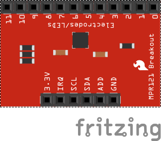

# Making a Potato Drum



In this resource, you will use a Capacitative switch to turn some conductive objects into switches.

## Prerequisites

Confifure I2C on the Pi <https://learn.adafruit.com/adafruits-raspberry-pi-lesson-4-gpio-setup/configuring-i2c>

```bash
sudo apt-get install -y python-smbus
sudo apt-get install -y i2c-tools
sudo raspi-config
    and turn on interfacing : I2C
```

and then reboot

## Connect MPR121 12 way capacitative switch to Pi

## Test to see if an i2c device has been recognised

sudo i2cdetect -y 1

## Setup dev environmant software

```bash
sudo apt-get update
sudo apt-get install build-essential python-dev python-smbus python-pip git
```

## Attempt 2

ref <https://www.raspberrypi.org/forums/viewtopic.php?t=55300&p=420169>

## Sonic Pi Keyboard to sound mapping

<https://gist.github.com/rbnpi/7e01964ab8110e6df1e6d823bd9c4dcb>

based on <https://learn.adafruit.com/mpr121-capacitive-touch-sensor-on-raspberry-pi-and-beaglebone-black/hardware>

## Licence

Unless otherwise specified, everything in this repository is covered by the following licence:

[](http://creativecommons.org/licenses/by-sa/4.0/)

***Potato Drum Kit*** by [Paul Smith](https://github.com/pauls1024/potato-drum) is licenced under a [Creative Commons Attribution 4.0 International License](http://creativecommons.org/licenses/by-sa/4.0/).

Based on a work at <https://github.com/raspberrypilearning/ultrasonic-theremin>
