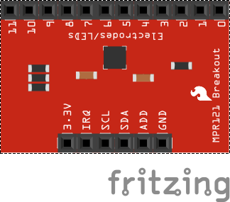
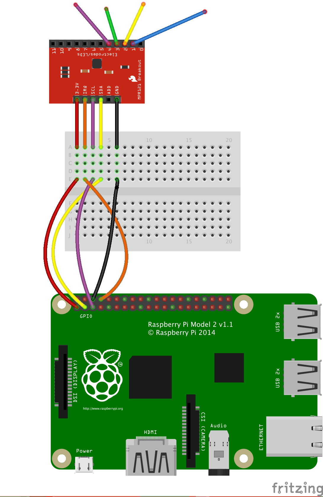

# The Raspberry Pi Potato Drum Kit

In this resource, you are going to make your very own drum kit using an 12 button capacitative switch (MPR121) and a little bit of Python and Sonic Pi code.

The breakout board does not have any buttons or switches on it, instead it has 12 pins that you can connect to any conductive object... like potatoes.  The MPR121 can then detect when you touch the potato!

If we can detect some event, then we should be able to make the computer react.  We are going to write a program that detects when you touch a potato, and then send a signal to Sonic Pi to tell it to play a sound.

## Setting up the circuitry

A Capacitative switch is a conductive object that can detect when another conductive object (like you) touches it.  When you touch the switch (potato) some electrical charge moves between
you and the potato.  And the MPR121 can detect that change in charge on the potato.  When it detects a change on any of the 12 switches it sends a message to the Pi.



An MPR121 12 way capacitative touch breakout board has 18 pins, 6 on one side of the board to connect to the Pi and 12 on the other to connect to swiches (potato, apple, tin foil...).

The connections to the Pi are called **3.3V**, **IRQ**, **SCL**, **SDA**, **ADD**, and **GND**.  Those pins need to be connected to the Pi as shown below.

```bash
MPR121    wire colour      Pi Pin (numbering 1-40)
3.3V      red               1
IRQ       orange            8
SCL       purple            5
SDA       yellow            3
ADD       not connected
Gnd       black             6
```

The diagram below shows one suggested arrangement for setting this up.



There are 12 pins on the other side of the MPR121 breakout board.  Connect some of them to potatoes, apples, tin foil... or any other conductive objects... these will be your touch switches.

## Detecting Touches

**THIS PROGRAM ONLY WORKS IN PTHON3**
**bin() and OSC fail in python2**

**You will need  acopy of the mpc121.py library file in the same directory as your new python file ... I'll help you with this bit.**

If you've wired up the sensor as shown in the diagram, then your trigger pin is **GPIO14**.

1. Click on **Menu** > **Programming** > **Python 3 (IDLE)**, to open up a new Python shell.
1. In the shell, click on **File** > **New File** to create a new Python file.
1. The code to detect touches is below. Type it into your new file, then save and run it by clicking on **Run** > **Run Module** or pressing **F5**.  To stop your program hold **CTRL** key and press **C**.

```python
from gpiozero import Button
import mpr121

# Use GPIO Interrupt Pin
trigger = Button(14)

# Use mpr121 class for everything else
mpr121.TOU_THRESH = 0x30
mpr121.REL_THRESH = 0x33
mpr121.setup(0x5a)

# create a place to store the last state (touched  or not touched) of each switch
touches = [0,0,0,0,0,0,0,0,0,0,0,0];

while True:
    #check to see if the mpr121 has set the interrupt pin
    if (trigger.is_pressed):
        print( "Something was touched or released")
        #read the data to see which switches are currently pressed
        touchData = mpr121.readData(0x5a)
    print( "Current switch state :" + bin(touchData)[2:].zfill(12))

```

The `touchData` is a binary number which shows which potatoes have been touched.  Binary means that each digit can be 0 or 1.  If you run the program you should see it printing a binary number when you touch a potato.  There are 12 switches, so you see a 12 bit binary number.  Each digit of the binary number represents a different potato.

Run the program, touch different potatoes.  You should see the binary number change every time you touch a potato.

## Getting Sonic Pi ready

Sonic Pi is going to receive messages from your Python script. This will tell Sonic Pi which note to play.

1. Open Sonic Pi by clicking on **Menu** > **Programming** > **Sonic Pi**
1. In the buffer that is open, you can begin by writing a `live_loop`. This is a loop that will run forever, but can easily be updated, allowing you to experiment with different sounds. You can also add a line to reduce the time it takes for Sonic Pi and Python to talk to each other.

 ```ruby
 live_loop :listen do
  set_sched_ahead_time! 0.1
 end
 ```

1. Next you can add another live loop to sync with the messages that will be coming from Python.

 ```ruby
 live_loop :listen do
  message = sync "/play_drum"
  drum = message[:args][0]
  cue :one if drum=="1"
  cue :two if drum=="2"
  cue :three if drum=="3"
  cue :four if drum=="4"
  cue :five if drum=="5"
  cue :six if drum=="6"
 end
 ```

1. The message that comes in will be a dictionary, containing the key `:args`. The value of this key will be the number of one of the potatoes you touched.

1. Lastly, you need to tell Sonic Pi what to do when it detects each of the potatoes.

 ```ruby
 in_thread do
  loop do
   sync :one
   sample :drum_bass_hard
  end
 end
 in_thread do
  loop do
   sync :two
   sample :drum_bass_soft
  end
 end
 ```

1. You can set this live loop to play straight away, by clicking on the **Run** button. You won't hear anything yet, as the loop is not receiving any messages.

## Sending notes from Python

To finish your program, you need to send values to Sonic Pi from your Python file.

1. You'll need to add the OSC library for this part. There are two imports to be added to the top of your file, to allow Python to send messages.

 ```python
 from gpiozero import Button
 import mpr121

 from pythonosc import osc_message_builder
 from pythonosc import udp_client

 # Use GPIO Interrupt Pin
 trigger = Button(14)

 # Use mpr121 class for everything else
 mpr121.TOU_THRESH = 0x30
 mpr121.REL_THRESH = 0x33
 mpr121.setup(0x5a)

 # create a place to store the last state (touched  or not touched) of each switch
 touches = [0,0,0,0,0,0,0,0,0,0,0,0];

 while True:
  #check to see if the mpr121 has set the interrupt pin
  if (trigger.is_pressed):
   print( "Something was touched or released")
   #read the data to see which switches are currently pressed
   touchData = mpr121.readData(0x5a)
   print( "Current switch state :" + bin(touchData)[2:].zfill(12))

 ```

1. Now you need to create a `sender` object that can send the message.

 ```python
 from gpiozero import Button
 import mpr121

 from pythonosc import osc_message_builder
 from pythonosc import udp_client

 sender = udp_client.SimpleUDPClient('127.0.0.1', 4559)

 # Use GPIO Interrupt Pin
 trigger = Button(14)

 # Use mpr121 class for everything else
 mpr121.TOU_THRESH = 0x30
 mpr121.REL_THRESH = 0x33
 mpr121.setup(0x5a)

 # create a place to store the last state (touched  or not touched) of each switch
 touches = [0,0,0,0,0,0,0,0,0,0,0,0];

 while True:
  #check to see if the mpr121 has set the interrupt Pin
  if (trigger.is_pressed):
   print( "Something was touched or released")
   #read the data to see which switches are currently pressed
   touchData = mpr121.readData(0x5a)
   print( "Current switch state :" + bin(touchData)[2:].zfill(12))
```

1. You need to convert the binary touchData into a series of message for Sonic Pi. For each of the potatos that has just been touched we want to sent the potato number to Sonic Pi

1. You might also want to add a couple of print lines, these help you to see what is going on when the program is running.  And it might be good if the SonicPi stops playing sounds when you have moved your hand away ... so lets only send data to Sonic Pi when the program calculates a new touch, and ignore the trigger when you let go of a potato.

```python
from gpiozero import Button
import mpr121

from pythonosc import osc_message_builder
from pythonosc import udp_client

sender = udp_client.SimpleUDPClient('127.0.0.1', 4559)

# Use GPIO Interrupt Pin
trigger = Button(14)

# Use mpr121 class for everything else
mpr121.TOU_THRESH = 0x30
mpr121.REL_THRESH = 0x33
mpr121.setup(0x5a)

# create a place to store the last state (touched  or not touched) of each switch
touches = [0,0,0,0,0,0,0,0,0,0,0,0];

while True:
  #check to see if the mpr121 has set the interrupt pin
  if (trigger.is_pressed):
    print( "Something was touched or released")
    #read the data to see which switches are currently pressed
    touchData = mpr121.readData(0x5a)
    print( "Current switch state :" + bin(touchData)[2:].zfill(12)
    #send a message to Sonic Pi for each switch currently touched
    for i in range(12):
      if (touchData & (1<<i)):
        if (touches[i] == 0):
          print( 'Pin ' + str(i) + ' was just touched')
          sender.send_message('/play_drum', str(i))
          touches[i] = 1;
        else:
          if (touches[i] == 1):
            print( 'Pin ' + str(i) + ' was just released')
            touches[i] = 0;
          else:
            pass
```

1. Save and run your code and see what happens. If all goes well, you've made your very own drum kit.

Remember you need to run this in python3 NOT python2.

## What next

- The Sonic Pi only plays sounds when you touch potato one or two.  Can you see why?

- Can you add more code in Sonic Pi so that it plays different sounds for the other potatoes.

- What happens if you change the timing in the Python file? Can you produce a smoother transition of notes?
